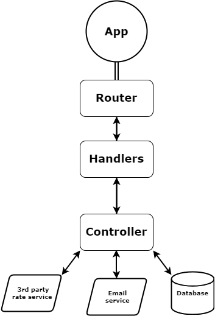

# Running the app

Open command prompt in project directory.
Build image with command:

```shell
docker build -t btc_app .
```

To run container use:

```shell
docker run -d -p 80:80 btc_app
```

# Using the app

App can provide bitcoin rate in uah, subscribe email
for getting bitcoin rate and send rate to subscribed emails

### /rate

**GET**

BTC rate in UAH.
Plain integer value

### /subscribe

**POST. application/x-www-form-urlencoded**

Subscribe email for future rate messages.
Email itself should be sent as request body with key "email".

### /sendEmails

**POST**

Send bitcoin rate to all subscribed emails

### More info can be found in api/swagger.yaml

# Structure



## Structure details

- **App** - structure that has a router and can start the whole service.
- **Router** - package that defines router with three endpoints(/rate, /subscribe, /sendEmails).
  Methods from the handlers package are called after hitting endpoints.
- **Handlers** - package that has clear methods to handle endpoints hitting.
  Mostly responsible for parsing input values and writing responses.
  Data for responses is provided by the controller.
- **Controller** - package that starts database and 3rd party rate service work.
  It makes sure that the needed task is done.
- **3rd party rate service** - one of the services. Package that requests service to get BTC rate in UAH.
  Right now app uses https://coinstats.app API.
- **Email service** - one of the services. Can send a message to a specific email. Uses gomail.
- **Database** - needed to store all emails that can receive BTC rate messages because of the subscription.
  Right now instead of a relational database app uses filesystem to store all emails.
